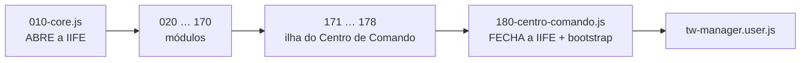

# Arquitetura

Como 33 arquivos viram um userscript, e as cinco regras que *todo* módulo obedece.

---

## 1. O build é concatenação pura

`tools/build.py` junta `src/*.js` em **ordem alfabética**, byte a byte. Não reindenta, não
reordena, não conserta nada. O que está em `src/` é o que vai pro ar.



Consequências que importam:

- **Não há `import`/`export`.** Todos os módulos partilham **o mesmo escopo léxico**. Uma
  função de `075-mercado` enxerga uma constante de `010-core` naturalmente.
- **Funções são içadas**, então a ordem entre elas não importa. **`const`/`let` não são**:
  precisam já ter executado, e a ordem é a numérica.
- **Erro de sintaxe derruba o bundle inteiro.** É um arquivo só. Por isso o `check.py` e o
  `new Function()` antes de commitar. Erro de *runtime*, esse sim, é contido: o bootstrap
  usa `try/catch` por módulo.

### A ilha isolada

`171` a `178` formam uma **IIFE aninhada** — o Centro de Comando rico. Ela **abre** em
`171-cc-nucleo.js` e **fecha** em `178-cc-painel.js`; nenhum arquivo do meio mexe em chave
de IIFE.

Existe pra os ~465 nomes internos (`cc*`/`cmd*`) não colidirem com o Centro de Comando novo
do v11 (`180`, também `cc*`). A ilha herda os helpers do escopo externo por closure.

> Regra do corte: **só função se move** entre os sete arquivos. Todo `const`/`let` de topo
> vive no núcleo, na ordem original — inicializador que executa
> (`const _mchan = new MessageChannel()`) depende da ordem do arquivo.

---

## 2. Ciclo de vida

Nenhum módulo se inicia sozinho. O caminho é sempre o mesmo:

```mermaid
sequenceDiagram
  participant TM as Tampermonkey
  participant Core as 010-core
  participant Boot as 180 (fim do arquivo)
  participant UI as 150-painel-ui
  participant Mod as um módulo
  TM->>Core: injeta o bundle
  Core->>Core: load() — lê twMgr_&lt;mundo&gt; e sanitiza
  Boot->>UI: buildUI()
  UI->>UI: monta o painel (9 abas)
  UI->>Mod: se config.&lt;mod&gt;.running → retomar(scheduleXxx)
  Note over UI,Mod: escalonado: 6s + 4s por módulo
  Mod->>Mod: xxxTick()
  Mod->>Mod: agenda o próximo e repete
```

**`running` é o que sobrevive ao F5.** `setTimeout` não sobrevive — por isso o estado do
módulo mora no `localStorage` e a retomada é explícita, no `buildUI()`. Um módulo que não
aparece naquela lista de retomada simplesmente não volta depois de um reload.

---

## 3. Os cinco mecanismos transversais

Estes não pertencem a módulo nenhum — eles disciplinam **todos**.

### 3.1 Trava de aba única

```js
lockOther()   // outra aba agiu nos últimos 12s?
claimLock()   // eu assumo agora
```

Duas abas do jogo abertas = dois scripts rodando = envio dobrado. A trava é uma chave no
`localStorage` com carimbo de tempo. Quem perde fica em espera e tenta de novo.

> É a única chave `twMgr*` **deliberadamente excluída do backup**: levar o lock de um PC pro
> outro faz a máquina nova achar que uma aba fantasma está trabalhando.

### 3.2 `devoParar(mod)` — o freio comum

Todo laço longo consulta isso entre iterações. Devolve o **motivo** ou `null`:

<div class="tabela" markdown="1">

| Motivo | Quando |
|---|---|
| `parado pelo usuário` | `config[mod].running === false` no meio do ciclo |
| `outra aba assumiu` | `lockOther()` |
| `bot-check na tela` | `captchaBlocked()` |
| *(Central disparando)* | janela crítica de um comando de precisão |

</div>

O último é o mais sutil e o mais caro: **a Central tem prioridade absoluta**. Um disparo com
hora marcada não pode disputar rede nem thread com um ciclo de saque. Já foi medido ao vivo —
o Saque atravessou a janela mandando 36 ataques e o comando saiu 556 ms atrasado.

### 3.3 Captcha

`130-captcha` observa a tela. Quando o bot-check aparece, `captchaBlocked()` passa a `true` e
todo mundo para via `devoParar`. É proteção de conta, não conveniência.

> Ponto aberto conhecido: `cmdTick()` (a Central) **não** consulta `captchaBlocked()` na
> entrada, e o `check.py` avisa isso a cada build.

### 3.4 Estado e backup

- Config principal: `twMgr_<mundo>`, gravada por `save()`.
- Satélites: `twMgr_<mundo>_alvos`, `_apoios`, `_log`, `_nobleTrail`, `_scoutHist`…

O backup (`155-backup`) copia **toda chave com prefixo `twMgr`** — não existe lista de campos
pra manter atualizada. Duas coisas quebram isso em silêncio:

1. **Chave nova sem o prefixo `twMgr`** fica de fora e o usuário a perde ao trocar de PC.
2. **Sanitizador que RECONSTRÓI objeto** (`lista.map((x) => ({a, b}))`) apaga o que não está
   no molde — inclusive campo importado de outro PC. Sanitize **corrigindo no lugar**.

### 3.5 Log e cache

- `pushLog(msg, kind, mod)` — linha no log compartilhado, marcada pelo módulo. O log tem teto
  de 200 linhas, então repetição idêntica a cada ciclo **varre pra fora** o histórico que
  explicaria um erro depois. Módulos que logam a mesma coisa todo ciclo dedupam de propósito.
- `cacheLer(nome, ttlMs)` / `cacheGravar(nome, valor)` — cache que sobrevive ao F5, com TTL.
  A idade gravada é a da **escrita**, não a da leitura: senão o TTL recomeça a cada reload e
  nunca expira.

---

## 4. Tempo

Precisão de milissegundo depende de saber que horas são **no servidor**, não aqui.

<div class="tabela" markdown="1">

| Função | O que é |
|---|---|
| `serverNow()` | `window.Timing.getCurrentServerTime()` do próprio jogo |
| `srvNowP()` | o mesmo, mas ancorado em `performance.now()` — imune a ajuste de relógio |
| `ccNow()` | relógio da Central, com reancoragem controlada |

</div>

O relógio do jogo é calibrado na resposta do **carregamento de página** e pode estar dezenas
ou centenas de ms adiantado do relógio real do servidor. Nenhum modelo de rede enxerga isso —
só a chegada publicada pelo jogo revela, e é o que a
[calibração](fluxo-centro-comando#calibração) aprende.

---

## 5. Onde as coisas quebram

Padrões que já causaram defeito real neste repo, e que valem como checklist:

<div class="tabela" markdown="1">

| Armadilha | Sintoma |
|---|---|
| Contador de teto declarado **dentro** da função chamada em laço | O teto vira "por item" em vez de "por ciclo" — e gasta o que não volta |
| `catch` que devolve `null` confundido com "nada a fazer" | Falha de rede **desliga** o módulo em silêncio |
| Estrutura de `config` sem poda | Cresce pra sempre; estoura a cota do `localStorage` e incha o backup |
| Cache sem `_At` (validade) | Decide com dado congelado até o F5 |
| Sanitizador que remonta objeto | Campo novo nasce morto e some na importação de backup |
| Ler tropa "em casa" sem contar a que está voltando | Reenvia o que já está na estrada |

</div>

O backlog vivo desses itens fica em [`MELHORIAS.md`](https://github.com/JonathanWillianBraga/tw/blob/main/MELHORIAS.md).
