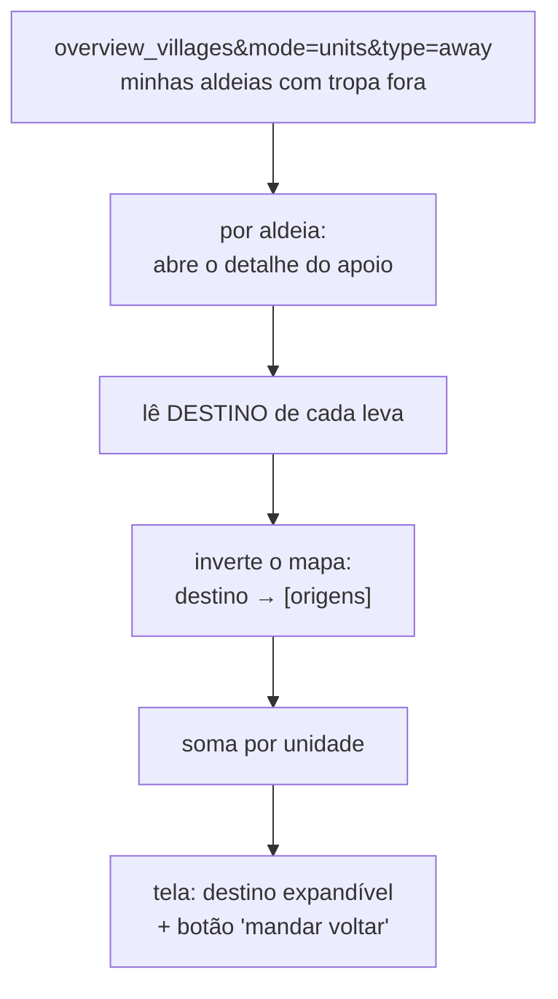
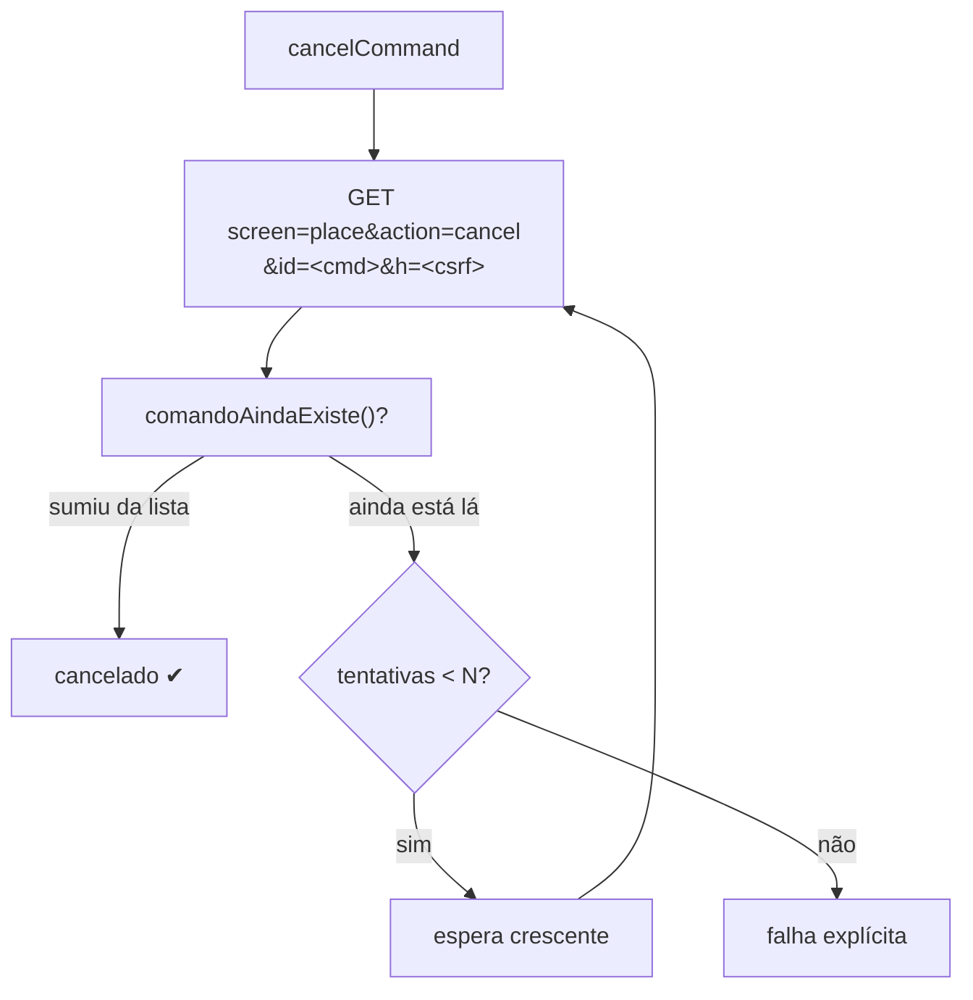

# Apoio e defesa

`086-apoios` (802) · `160-desviar` (617) · `050-envio` (86)

---

## `086-apoios.js` — Apoios enviados, por DESTINO

O jogo só mostra tropa fora agrupada por **origem**: *"a aldeia 001 tem 1999 lanças fora"*.
Nunca *"a aldeia X está recebendo 1999 lanças, vindas de 001, 015 e 027"*.

**A inversão é nossa, e é o valor da tela.**

O agrupamento por destino é o que permite responder *"quanto essa aldeia realmente tem
defendendo?"* — e retirar apoio de um lugar sem caçar aldeia por aldeia.

---

## `160-desviar.js` — desviar e cancelar comandos

Cancela comandos seus que já estão voando. Módulo pequeno com uma primitiva que vale por
todo o resto do repo.

### `cancelCommand(vid, cmdId)`

Duas coisas nessa função merecem destaque, porque as duas custaram caro:

**1. A tela certa.** Até a v11.212.0 usava `screen=info_command&action=cancel`. Aquela tela
responde **HTTP 200** e não cancela nada — então todo cancelamento era reportado como
sucesso, com a tropa fora o tempo todo.

Capturar o endereço certo exigiu um comando **fresco**: o mundo só mostra o link de cancelar
dentro de `command_cancel_time` (600 s aqui), então nenhum comando antigo da conta exibia o
link nem na tela renderizada.

**2. A prova de que cancelou.** A **única** prova que vale é o comando ter sumido da lista de
saídas da aldeia. HTTP 200 não é prova. E a checagem repete algumas vezes antes de declarar
falha — senão um cancelamento bom vira retentativa e alarme falso.

> Esta primitiva é o que torna a [calibração](fluxo-centro-comando#o-botão-calibrar-agora)
> possível: mandar comando de verdade, medir, e não deixar tropa na estrada.

---

## `050-envio.js` — primitivas compartilhadas

86 linhas, sem ciclo. Era o módulo Fakes; virou a caixa de ferramentas de quem envia:

| Função | O que faz |
|---|---|
| `getFakeVillage(vid)` | tropa disponível + população máxima de uma aldeia |
| `getVillagePoints()` | pontuação de todas as aldeias do mundo (do `village.txt`) |
| `applyReservationsToAvail()` | desconta o que outros módulos reservaram |

`getVillagePoints` cacheia por 6 h em disco. Sem TTL, e com auto-F5 a cada 2 min, o
`village.txt` do mundo inteiro era rebaixado praticamente a cada reload.

### Limite de fake

`FAKE_LIMIT_PCT` define a população mínima que um fake precisa levar, em % dos pontos da
aldeia de origem. Consequência prática: um modelo de 102 de população cobre origens até
10.200 pontos — acima disso, o modelo precisa crescer ou o jogo recusa.
