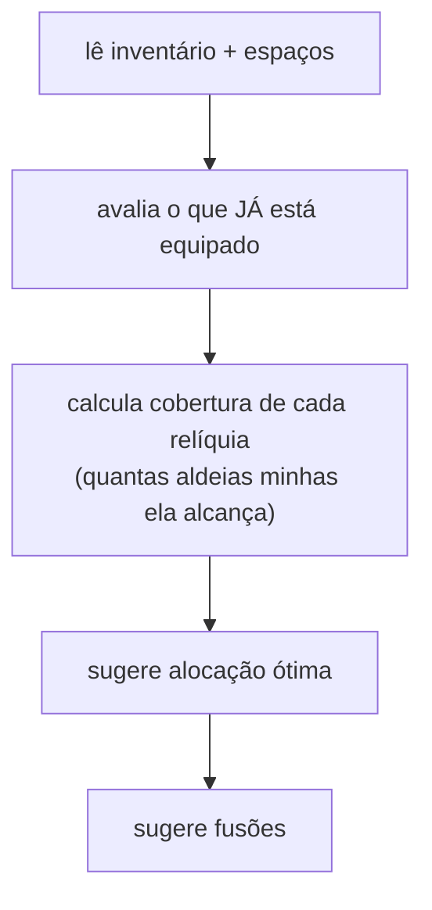

# Auxiliares

`070-paladino` · `092-reliquias` · `088-alvos` · `155-backup` · `130-captcha` ·
`140-painel-controllers` · `150-painel-ui`

---

## `070-paladino.js` — Paladino

Ciclo curto que cuida do paladino: mantém a arma/habilidade escolhida e o mantém ativo.
Segue o esqueleto comum de tick.

---

## `092-reliquias.js` — Relíquias

Sem ciclo: é uma tela de **análise sob demanda**. Responde duas perguntas — *onde equipar* e
*o que fundir*.

### Como o jogo expõe

O inventário vem como **JSON embutido no HTML** de `screen=relic_system`. Isso importa: a
grade visível é paginada, e ler só a página 1 dava 20 relíquias quando o inventário real
tinha 56.

<div class="tabela" markdown="1">

| Qualidade | Alcance (casas) |
|---|---|
| shoddy / polished | 2 |
| refined / superior | 3 |
| renowned | 4 |

</div>

A distância é **euclidiana** — validado 6 de 6 contra os números que o próprio jogo mostra.

### O que a análise faz



Duas pegadinhas do sistema que a tela precisa respeitar:

- **Os espaços são limitados pelo número de aldeias.** Relíquia equipada além do limite vem
  marcada com `inactive_until` — ou seja, *equipada mas inativa*. Numa conta real havia 13
  equipadas e só 6 ativas.
- **O bônus empilha até um teto** por tipo.

> O script é compartilhado entre três jogadores. Nada aqui — nem inventário, nem aldeia, nem
> conta — pode ser fixado no código.

---

## `088-alvos.js` — fichas de alvo

Guarda a "vocação" de cada aldeia alvo: o que ela é pra você (farm, nobre, fake…), notas e
histórico. Vive em `twMgr_<mundo>_alvos`.

---

## `155-backup.js` — exportar / importar

Leva a conta de um PC pro outro. E "nada se perde" aqui é literal: a config **não mora numa
chave só**. São ~22 chaves — a principal mais as satélites que módulos diferentes criaram.

**A coleta é por PREFIXO**, não por lista escrita à mão:

```js
if (!k || k.indexOf('twMgr') !== 0 || bkpExcluida(k)) continue;
```

Campo novo dentro de `config` entra no export sozinho. Duas coisas quebram isso em silêncio —
ver [Arquitetura › Estado e backup](arquitetura#34-estado-e-backup).

A **única** chave deliberadamente excluída é o `_lock`: ele diz *"tem uma aba agindo agora"*.
Levar o lock do PC velho faz o PC novo achar que outra aba está trabalhando e ficar parado
esperando uma aba que não existe.

### Antes de sobrescrever, o resumo

Backup é operação **sem desfazer**. Por isso a importação conta o que está entrando — *"142
ataques programados, 8 alvos no Noblar, 31 chaves"* — pra o usuário reconhecer a própria
conta antes de confirmar. E apaga as chaves atuais **antes** de escrever: sem isso, config que
existe aqui e não existe no backup sobreviveria e se misturaria com a importada.

O arquivo passa de 1 MB numa conta rodada, então é download, não área de transferência.

---

## `130-captcha.js` — o freio de segurança

Observa a tela. Quando o bot-check aparece, `captchaBlocked()` passa a `true` e todo módulo
para via [`devoParar`](arquitetura#32-devopararmod--o-freio-comum).

Não é conveniência: é proteção de conta.

---

## `140-painel-controllers.js` e `150-painel-ui.js` — a interface

- **`150-painel-ui`** monta o painel (9 abas), o CSS, e — no fim do `buildUI()` — **retoma os
  módulos** que estavam ligados. É o ponto onde o script "acorda" depois de um F5.
- **`140-painel-controllers`** liga botão a função: ler config da tela, gravar, iniciar/parar.

### As 9 abas

`Muralha` e `Mapa` **não** são abas: viraram **sub-abas dentro do Saque**, junto com
`Estatísticas`. O Cadeado vive dentro do Mapa, então foi junto. As chaves de módulo (`wall`,
`map`) seguem valendo em `config`, `refreshCards` e `pushLog`.

O indicador de atividade fica no botão da sub-aba, e a aba Saque acende se **qualquer** um
dos três estiver rodando.
