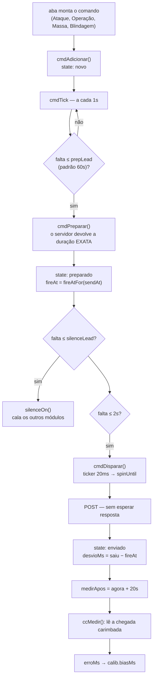
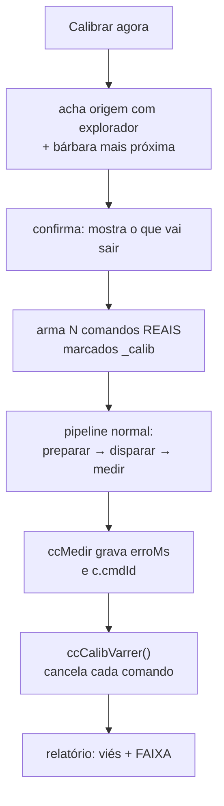
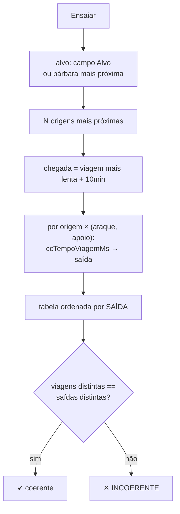

# Centro de Comando

`171` a `179` (a **ilha**) · `180-centro-comando` (motor `cc`)

O subsistema de **precisão**: mandar comandos que chegam na hora marcada, ao milissegundo.
É o único lugar do script onde o erro se mede em ms.

> **Atenção — existem DOIS motores.** `config.cmd.fila` (dirigida por `cmdTick`, na ilha) é a
> que a praça usa. `config.cc.fila` (dirigida por `ccMotor`, no `180`) é um motor separado
> com página própria, mantido vivo só pra não perder comandos de sessões antigas. Eles **não
> partilham estado**. Unificar é decisão em aberto.

---

## A ilha, depois do split

Era um arquivo de 5297 linhas. O corte foi por **nome de função**, não por comentário de
seção — as seções mentiam: `ccMassaEnviar` (Apoio em massa) morava fisicamente *dentro* do
bloco da Blindagem. Era literalmente isso que fazia mexer numa aba quebrar a outra.

<div class="tabela" markdown="1">

| Arquivo | Linhas | Papel |
|---|---:|---|
| `171-cc-nucleo` | 1174 | **ABRE a ilha.** Estado, motor de precisão, silêncio, despachante, tempo de viagem |
| `172-cc-praca` | 2103 | Superfície **compartilhada**: origens, tropas, prévia, fila, comandos do jogo |
| `173-cc-operacao` | 539 | Aba Operação (`ccOp*`) |
| `174-cc-atkmassa` | 172 | Aba Ataque em massa (`ccAtkm*`) |
| `175-cc-apoiomassa` | 133 | Aba Apoio em massa (`ccMassa*`) |
| `176-cc-blindagem` | 447 | Aba Blindagem da tribo (`ccBlz*`) |
| `177-cc-calibrar` | 276 | Calibração do agendador (`ccCalib*`) |
| `178-cc-ensaio` | 190 | Ensaio de operação (`ccEnsaio*`) |
| `179-cc-painel` | 855 | Monta o HTML, injeta nas telas, **FECHA a ilha** |

</div>

Regra do corte: **só função se move**. Todo `const`/`let` de topo ficou no núcleo, na ordem
original — funções são içadas, `const` não.

---

## O caminho de um comando



### Por que não esperar a resposta do POST

Num trem de 150 ms, aguardar o HTTP (300 ms+) faria a onda seguinte perder o próprio horário.
A linha é liberada assim que o POST parte.

### Por que um de cada vez

Dois *spins* simultâneos brigariam pela mesma thread e ainda dependeriam da ordem em que o
servidor processa POSTs concorrentes — o que embaralharia o trem de nobres.

### A medição é agendada no DISCO

`c.medirApos = srvNowP() + 20000`, e quem executa é a varredura do `cmdTick`.

Era um `setTimeout(..., 20000)` dentro de um `.then`. Um timer de 20 s preso numa closure
morre em tudo que acontece o tempo todo: F5, aba estrangulada em segundo plano, e outra aba
assumindo a trava. Não havia *retry* nem log — a amostra sumia calada, e `calib.n` ficava em
zero pra sempre.

---

## O modo silêncio

Antes do disparo, a Central **cala** os outros módulos pra reservar a linha. Duas Centrais
avisam de jeitos diferentes: o motor `cc` pela janela crítica, e o motor `cmd` gravando uma
chave de silêncio.

> A segunda chave estava sendo **escrita e nunca lida**. O comentário dizia que as abas
> respeitariam "via `lockOther()`", mas `lockOther()` lê outra chave. Efeito medido ao vivo:
> o Saque atravessou a janela mandando 36 ataques e o comando saiu **556 ms** depois da hora.

---

## Calibração

O agendador depende de **um** número: quantos ms antes o POST tem que sair pra o servidor
**processar** na hora pedida (`calib.biasMs`).

Esse número **não dá pra calcular**. Ele soma três coisas que não são observáveis
separadamente:

1. latência de ida,
2. tempo de processamento do servidor,
3. **desvio do relógio de referência do jogo** — que é calibrado na resposta do carregamento
   de página e pode estar centenas de ms adiantado do relógio real.

O terceiro é o que mata modelo de rede: já apareceu no uso real um lead de 180 ms produzindo
chegada 200 ms **adiantada**, aritmética que só fecha com o relógio à frente.

### Como o viés aprende

```js
const alpha = (k.n < 3) ? 0.6 : 0.25;      // rápido no começo, estável depois
k.biasMs += (erroMs - ALVO_ATRASO_MS) * alpha;
```

**Mira +2 ms atrasado, não zero.** O erro é assimétrico: num snipe, chegar adiantado *perde*
o comando; chegar 2 ms tarde não custa nada. Mirar exatamente zero deixa metade da dispersão
cair do lado ruim.

Três guardas impedem que uma medição ruim envenene o viés:

<div class="tabela" markdown="1">

| Guarda | Por quê |
|---|---|
| Só amostra **com milésimos** | sem eles o sinal é quantizado em 1 s |
| Teto de plausibilidade (3 s) | uma medição que casou com o comando errado já saturou o viés em −1500 ms e fez todo comando sair 1,5 s atrasado |
| Guarda de deriva (50 ms) | se a *minha* escada soltou atrasada, o erro mede contenção de thread, não rede — e corrigir contenção com lead é impossível |

</div>

### O botão "Calibrar agora"

Antes, a única medição era **passiva**: esperar você mandar um ataque real. Dois buracos —
o primeiro ataque importante sai com `calib.n = 0` (e com n = 0 o lead é **zero**), e quando
a medição falha calada, `calib.n` fica em zero pra sempre sem avisar.



**Tem que ser comando de verdade.** O erro nasce entre o `fetch` sair daqui e o servidor
carimbar — nenhuma simulação atravessa esse trecho.

**Segurança em camadas:** explorador (nunca tropa de combate); a varredura de cancelamento
roda do `cmdTick` e não de `setTimeout` (aqui, timer morto = tropa na estrada); o marcador
`_calib` vai pro **disco**, dentro do comando; e recusa rodar com a fila ocupada.

**Margem de 90 s até o primeiro disparo**, de propósito: a fila raciocina por chegada e deduz
a saída subtraindo a duração — mas a duração aqui é **estimativa local** (a exata só vem do
preparo). Se ela subestimar, a saída anda pra trás e o comando morre em "horário já passou"
sem medir nada.

### Dispersão, não só média

`calib.amostras` guarda os 12 últimos erros crus, e a tela mostra a **faixa**.

Um viés sozinho é confiança falsa: `+40 ms` pode ser *"sempre +40"* ou *"às vezes −200, às
vezes +280"* — e são decisões opostas na hora de mirar um snipe. A tela dá o veredito em
português (**firme / aceitável / instável**) com a janela mínima que a medição sustenta.

---

## Ensaio de operação

Responde, sem gastar nada, a pergunta que antes só se respondia arriscando uma operação de
verdade: **a conta de viagem, saída e ordem está certa?**

Pega o alvo (o campo Alvo, ou a bárbara mais próxima), escolhe as **N aldeias mais próximas**
dele — a mesma escolha que o armar de verdade faz — e programa **ataque e apoio** de cada uma
pra chegarem todos no mesmo horário.



**É seco por padrão.** Um "teste" que arma comando na fila não é teste: o motor prepara 60 s
antes da saída e **dispara**. Você olharia a tabela, se distrairia, e a tropa sairia. Armar de
verdade é um segundo botão, explícito, e o que ele arma leva o marcador `_ensaio` — o
`🧹 limpar ensaio` tira só isso da fila, sem encostar no que você armou à mão.

**Não é uma simulação escrita à parte** — usa `ccTempoViagemMs`, o mesmo cálculo do armar real.
Se a conta estiver errada, a tabela mostra errado, que é o que se quer de um ensaio.

### Por que ataque *e* apoio na mesma tabela

Porque é onde o erro aparece. Os dois miram a **mesma chegada**, mas a tropa é diferente
(cavalaria leve × lanceiro) → a viagem é diferente → a **saída** tem que ser diferente.

Daí a conferência automática no topo da tabela: *n viagens distintas devem produzir n saídas
distintas*. Se duas linhas com viagens diferentes mostram a mesma saída, tem defeito — e a
tela diz isso em vermelho em vez de esperar você reparar.

---

## As abas

<div class="tabela" markdown="1">

| Aba | Para quê |
|---|---|
| ⚔ **Ataque / Apoio** | um comando, com composição e horário |
| 🎭 **Fake** | dezenas de alvos de uma vez, com duas distribuições possíveis |
| 🎯 **Operação** | **um alvo por vez** é o container: dentro dele, as aldeias participantes e uma lista ordenada de ondas com horário calibrável |
| 💥 **Ataque em massa** | cola os alvos, escolhe grupo e tropa; distribui minimizando a maior viagem |
| 🚚 **Apoio em massa** | apoio das origens marcadas, disparado **agora** (não agenda) |
| 🛡 **Blindagem** | lê o tópico da tribo e divide os pedidos entre as suas aldeias |

</div>

### Defasagem entre ondas

Só ondas **da mesma aldeia** precisam de espaçamento entre si (é a mesma conta enviando mais
de um comando — nuke e trem de nobre). Ondas de aldeias diferentes têm a viagem calculada
cada uma pela sua origem, então todas miram o mesmo horário de chegada, sem gap artificial.

### Confirmação antes de disparar

Ações em massa perguntam antes, dizendo **o que vai sair** — número de envios, origens ×
alvos, tropa por extenso — em vez de "tem certeza?".

> O Apoio em massa não perguntava: um clique soltava `origens × alvos` comandos, sem teto. 40
> origens e 20 alvos = 800 comandos, e no modo `tudo` é o exército inteiro saindo de casa.
