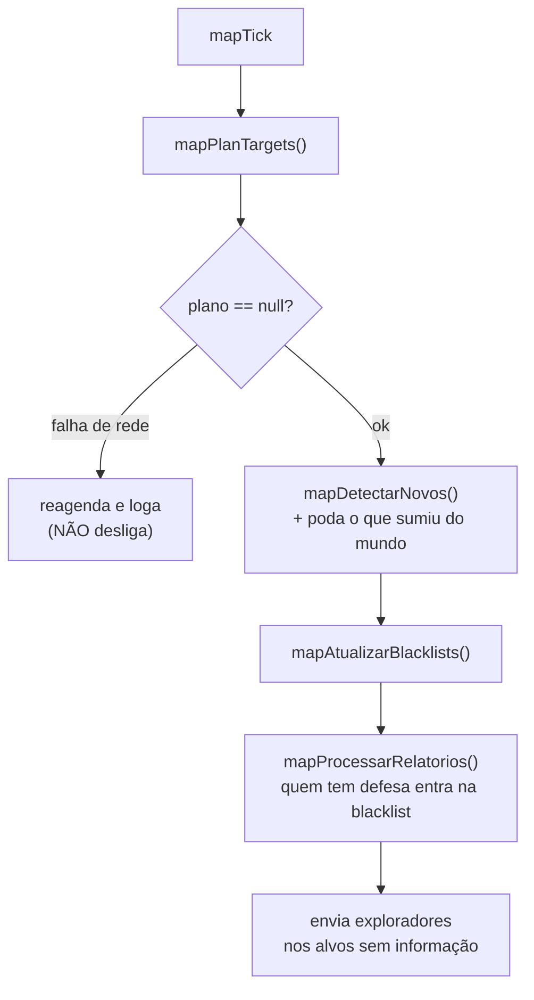
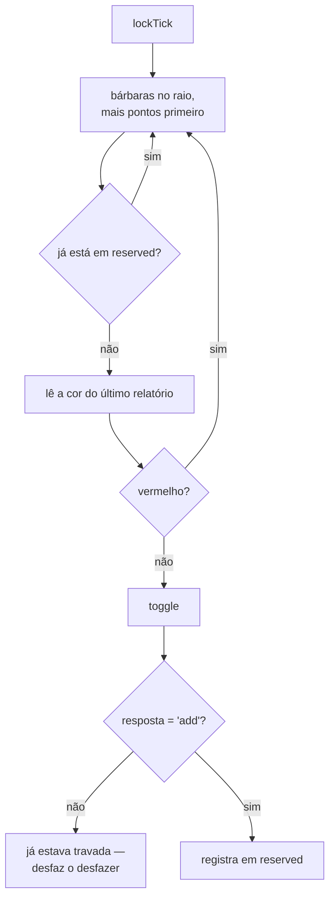

# Mapa e bárbaros

`100-barbaros-mapa` (627) · `110-cadeado` (112) · `170-mapa` (649) · `120-etiqueta` (156)

Quatro módulos que partilham uma fonte de dados: **`/map/village.txt`**, o mundo inteiro num
arquivo (~3,5 MB neste servidor).

> `getMapVillages()` cacheia por 6 h, em memória **e** em disco. A idade gravada é a da
> escrita, não a da leitura — senão o TTL recomeçaria a cada F5 e nunca expiraria.

---

## `100-barbaros-mapa.js` — Bárbaros do Mapa

Varre o `village.txt`, acha bárbaras no critério e manda explorador nas que ainda não têm
informação. É um ciclo **contínuo**: a cada volta relê o mapa e detecta bárbara nova.

### Estados de conhecimento

Guardados como **número**, não objeto: com milhares de aldeias no raio, a diferença entre
gravar um código e gravar um objeto é centenas de KB num `localStorage` de ~5 MB.

| Código | Significado | Cor |
|---|---|---|
| `OK` | tenho relatório com dados | verde |
| `VAZIO` | relatório sem informação (o explorador morreu) | âmbar |
| `NADA` | nem aparece no assistente | cinza |
| `ROTA` | explorador a caminho agora | azul |
| `BL_PERDA` | blacklist: perdi tropa | laranja |
| `BL_DEFESA` | blacklist: tem defesa | vermelho |

As duas blacklists se comportam diferente de propósito: a de **perda** sai sozinha quando
aparece relatório verde/amarelo/azul (o saque voltou bem); a de **defesa** não sai — tropa
defensiva não some porque o próximo saque deu certo.

### Falha de rede não desliga

`mapPlanTargets()` devolve `null` **só** em erro de rede — plano vazio volta como objeto.
Antes, o `null` caía num `cfg.running = false` e um `429` no `village.txt` **desarmava o
módulo de vez**, com o botão voltando pro estado "parado" sem explicar nada.

### Poda de `barbConhecidos`

Sai vid que sumiu do `village.txt`. **Não** poda pela lista já filtrada de bárbaros: ela passa
por `minPoints`/`maxPoints`, e um bárbaro que só saiu da janela de pontos voltaria anunciado
como "NOVO" ao reentrar. Falso alarme é pior que a gordura que a poda tira.

---

## `110-cadeado.js` — reserva de bárbara

Trava aldeia bárbara pra tribo, no raio das suas aldeias.

**O endpoint é um TOGGLE.** Chamar de novo **destrava**. Por isso o módulo guarda em
`config.lock.reserved` quem ele já travou e nunca chama em cima — sem essa memória, rodar
duas vezes seguidas destravaria tudo.

A poda aqui é **covarde de propósito**: só sai vid que deixou de ser bárbaro. Apagar a
memória de uma aldeia ainda candidata faria o ciclo seguinte destravar o que estava travado.

---

## `170-mapa.js` — filtros na tela do jogo

Sem ciclo. Enriquece o `screen=map` do jogo: painel de controle (só bárbaros / só minhas /
só tribo / filtro por pontos), atenua o que está fora do filtro por `opacity` (sem quebrar o
clique) e põe *badge* de pontos.

Usa `village.txt` **e** `player.txt` — sem o segundo não dá pra distinguir tribo. Falha do
`player.txt` é anunciada, não engolida: um filtro de tribo que silenciosamente não filtra é
pior que um filtro que avisa que não sabe.

---

## `120-etiqueta.js` — auto-rotular ataques recebidos

O jogo já tem o recurso: na tela de ataques recebidos, selecionar comandos e clicar
"Etiqueta" faz o **servidor** adivinhar a unidade mais lenta pelo tempo de viagem restante,
assumindo que o comando acabou de sair.

**Quanto mais cedo depois do envio, mais precisa a adivinhação** — daí o ciclo curto (padrão
2 min). Esse é o módulo inteiro: chegar antes.
