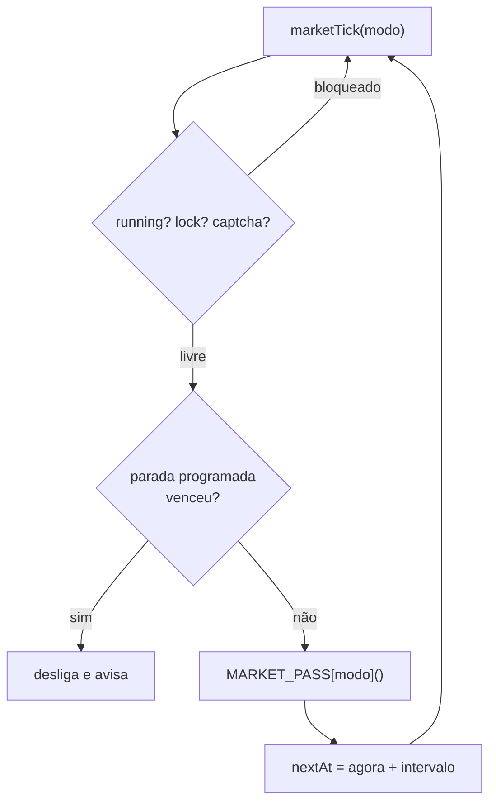
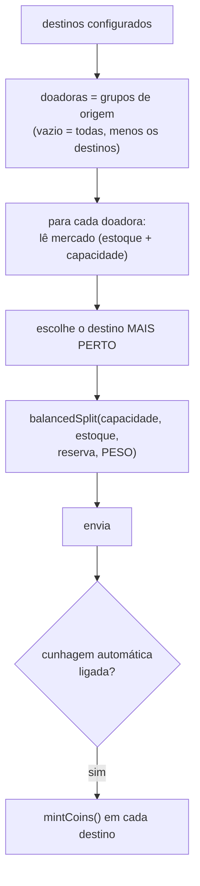

# Mercado

`075-mercado.js` (813 linhas) · config `market`

Um módulo, **três modos independentes**, cada um com seu próprio `running`, seu próprio timer
e sua própria estatística. Os três partilham o despachante `marketTick(modeKey)` e a
primitiva de envio.

<div class="tabela" markdown="1">

| Modo | Pergunta que responde |
|---|---|
| **Cunhagem** | como levo recurso pra aldeia que vai cunhar moeda? |
| **Equilíbrio** | como espalho o excedente pra ninguém transbordar nem passar fome? |
| **Solidário** | como alimento um grupo que só recebe? |

</div>

---

## O que todos têm em comum



### A lição do "recurso na estrada"

O módulo mantinha um caderninho local (`config.market.inflight`) do que ele mesmo tinha
mandado, expirando cada registro pela duração do transporte. Só que a duração quase nunca era
lida, e caía num *fallback* de 1 hora. Transporte mais longo que isso **sumia do caderno
enquanto ainda estava voando**: o ciclo seguinte via a aldeia vazia e mandava tudo de novo.

A correção foi perguntar ao jogo. A **mesma página** já traz a linha `Entrada: 🪵 … 🧱 …` —
de graça, o fetch já aconteceu. Hoje o que conta é o **maior** entre o caderno local e o que
o jogo diz, nunca a soma (seria contar o mesmo transporte duas vezes).

> A lição é a mesma do Noblar: **quando o jogo sabe a resposta, pergunte pra ele** em vez de
> manter escrituração paralela que precisa dar certo pra sempre.

---

## Cunhagem

Leva recurso das aldeias doadoras pro(s) destino(s) que vão cunhar moeda.



O **peso** existe pra casar com o custo do nobre (padrão 28k/30k/25k). Zerar os três volta
pro split igual.

`balancedSplit` não é "pega o peso e pronto": a cada iteração ele reparte a capacidade
**restante** na proporção do peso **entre quem ainda tem espaço**. Se um recurso bate no teto
do estoque disponível, a sobra vai pros outros dois em vez de ficar sem uso.

---

## Equilíbrio

Espalha excedente entre as suas aldeias. Duas decisões merecem atenção.

### Alvo automático por recurso

Com limiar fixo de 50%, uma aldeia só doa pra quem está **abaixo** de 50%. Quando um recurso
passa de 50% em *todas* as aldeias, não sobra receptora nenhuma — nada se move e a mais cheia
transborda, com o módulo ligado.

O alvo automático sai do que a conta **realmente tem**: a fatia que aquele recurso ocupa da
capacidade total de armazenamento. Sempre há alguém acima e alguém abaixo da média.

### A fila é por carência RELATIVA

```js
// antes: b.def - a.def        → maior déficit BRUTO primeiro
// hoje:  b.falta - a.falta    → quem está mais perto de zerado primeiro
```

O critério bruto favorecia sistematicamente aldeia grande e **matava de fome as pequenas**: o
buraco delas é pequeno em unidades mesmo estando em 2% do alvo, então ficavam sempre no fim
da fila, e quando chegava a vez a capacidade de mercador já tinha acabado.

`falta` é a fração do alvo que ainda não se tem (1 = vazia). **O quanto ela recebe continua
saindo do déficit real** — o que mudou foi só a ordem de atendimento.

### Trava de transbordo

Independente do limiar: o que está no armazém **mais** o que está na estrada não pode passar
da capacidade. Recurso que chega em armazém cheio é perdido. Sobra um respiro de 2% pra
produção entre ciclos.

---

## Solidário

As aldeias do grupo escolhido **só recebem**, nunca doam. Doadoras são todas as outras,
testadas da mais próxima pra mais longe.

Três proteções em camadas:

1. **Piso normal** — a doadora guarda uma % do recurso mais baixo que ela tem (protege quem
   já está capenga em algum recurso, mesmo doando um abundante), com piso absoluto por baixo.
2. **Piso de carência** (`donorMinPct`) — separado do limiar de carência de propósito: se o
   limiar for configurado agressivo (85%, "deixa todo mundo quase cheio"), isso **não** pode
   travar todo mundo de doar, senão o Solidário para de mandar qualquer coisa.
3. **Gargalo** — se ninguém passa no piso normal, a mais próxima cede só a fatia acima de
   `keepPct` (padrão 90%) do que tem, uma vez só. Nunca esvazia, nunca drena várias.

---

## Pacotes de recurso

Bônus fora dos três modos. O pacote do jogo enche todas as aldeias com uma % do armazém **de
cada uma** — o mesmo pacote pode ser perfeito numa e desperdício em outra, e não dá pra saber
de cabeça com 30 aldeias.

A tela calcula as oito opções de uma vez e responde a pergunta prática: **qual é o maior
pacote que ainda não desperdiça nada?**

> Detalhe que já enganou: quando o recurso passa de 90% do armazém, o jogo **troca a classe
> CSS** de `res` por `warn_90`. Filtrar por `.res` pulava justamente as aldeias quase cheias
> — as únicas que interessam.
