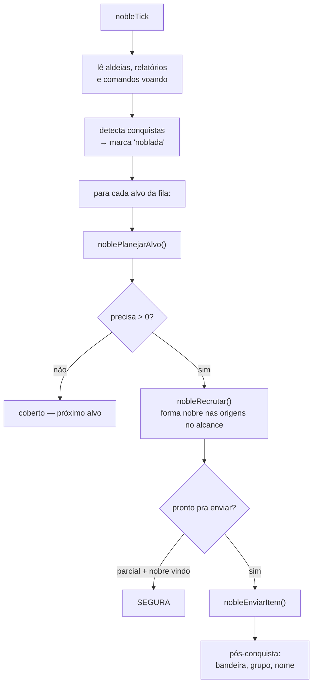
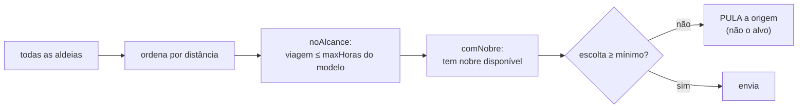

# Noblar

`084-noblar.js` (2966 linhas) · config `noble`

O maior módulo do repo, e o de decisão mais cara: nobre custa moeda, moeda custa recurso, e
nada disso volta.

Ele mantém uma **fila de alvos** e, para o alvo da vez, decide três coisas em ordem:
**quanto ainda falta**, **de onde sai**, e **se vale mandar agora ou esperar**.

---

## O ciclo

---

## A pergunta central: quantos nobres faltam

`noblePrecisaDe()` não devolve "o que o modelo pede". Devolve **o que ainda falta**, e a
diferença é grande:

- **Lealdade baixa precisa de menos** nobres.
- **Comando já a caminho conta como se tivesse pousado** — a projeção de lealdade inclui o
  que vai pousar, não só o que já pousou.

A linha do tempo é refeita a cada comando que o plano acrescenta: o plano **para no comando
que derruba a lealdade**, em vez de encher até um número decidido antes de conhecer as
viagens reais.

---

## Escolha da origem

### Escolta mínima

`escoltaMinPct` (padrão **100**) exige, por unidade, uma fração da cota do modelo. Origem que
não alcança é **pulada** — não o alvo. A próxima mais próxima pode ter a tropa, e essa é a
diferença entre travar um alvo e escolher melhor a origem.

Existe porque "envio parcial vale" chegava ao extremo de mandar `{snob: 1}` puro. Nobre
sozinho morre pra qualquer defesa, inclusive milícia de bárbara — e como a lealdade só cai se
o ataque **vencer**, um nobre pelado que morre é gasto irreversível com efeito zero.

> Se os nobres não estão saindo, este é o primeiro número a conferir: com a escolta em 100% e
> a cavalaria fora saqueando, toda origem é pulada.

---

## Produção: os dois tetos que já falharam

Esta é a parte que mais gerou defeito, e os dois defeitos são **a mesma família**: contador
que não enxerga o que já existe.

### Teto de cunhagem — era por ALVO

`cunhadas` morava **dentro** de `nobleRecrutar()`, que roda **uma vez por alvo**. Cada alvo
zerava o contador: com o padrão de 3 e 4 alvos na fila, o ciclo cunhava em até **12 aldeias**
enquanto a interface prometia 3.

Hoje o contador é um objeto criado no escopo do ciclo e passado por parâmetro. **Objeto e não
número** de propósito: número seria cópia, e o teto voltaria a ser por alvo em silêncio.

### Nobre parado não contava

O critério de parada era `formados + naFila >= faltam` — o que **ele formou** e o que está na
**Academia**. Nobre já pronto e parado numa origem era invisível.

O resultado era um moinho: o planner não usa o parado (escolta fora, `soNT`, ou o plano já
fechava sem ela) → `falta` continua alto → o ciclo forma **mais** por cima. Matar os
sobressalentes só liberava o limite da conta, e o ciclo seguinte refazia os mesmos.

Hoje `parados` soma `o.nobres` sobre a lista inteira de origens no alcance, **antes** do laço
(se fosse contado durante, o teto dependeria da ordem de visita). Quando os parados já cobrem
o que falta, ele não forma nada e diz o porquê:

> não formei nada: já existem 3 nobre(s) PARADOS no alcance e faltam 2. Se eles não estão
> saindo, o que falta é escolta ou alcance, não nobre — formar mais não resolve.

E não empilha em aldeia que já tem nobre parado — a regra gêmea pra fila da Academia
(*"já tem nobre vindo daqui"*) existia; a do nobre **pronto** faltava.

---

## Enviar ou segurar

Com envio parcial possível e nobre em produção, o módulo **segura**:

> Mandar agora gasta o único nobre que existe, e a lealdade (regen ~1/h) volta antes do
> próximo chegar. Parcial é pra quando não dá pra recrutar mais.

`parcialSempre` desliga essa espera.

---

## Pós-conquista

Quando a aldeia cai, o módulo aplica o que estava configurado: **bandeira**, **grupo** e
**nome**. Só marca como feito se **algo** deu certo — senão uma falha de rede aposentaria a
aldeia pra sempre e ela nunca entraria no grupo.

`posFeitos` é podado pelo que as três leituras percorrem: sai coord que não está em
`conquistadas` **nem** em `alvos`.

---

## Trilha de decisão

`nbTrail(coord, 'decisao', {...})` grava, **todo ciclo**, os números que decidiram: lealdade
medida, lida e prevista, nobres voando, gasto, limite, folga, o que o modelo pede e o que
falta.

É daqui que sai a resposta de *"por que esse alvo recebeu (ou não) nobre"*. O log geral tem
teto de 200 linhas e é compartilhado com todos os módulos — repetição idêntica a cada ciclo
varreria pra fora justamente o histórico que explicaria o erro. Por isso a trilha é separada,
e o log só repete quando algo muda.
