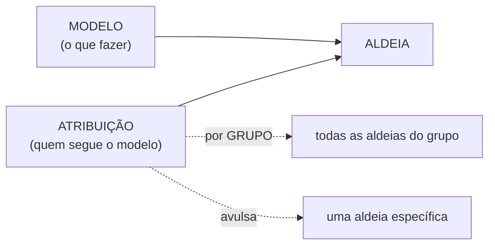
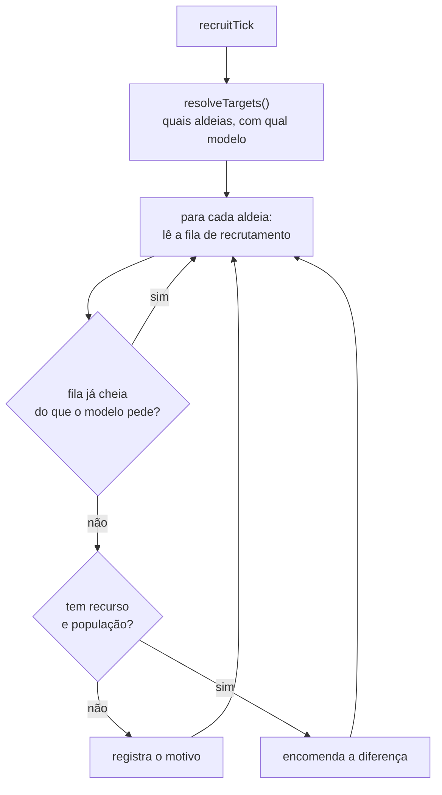
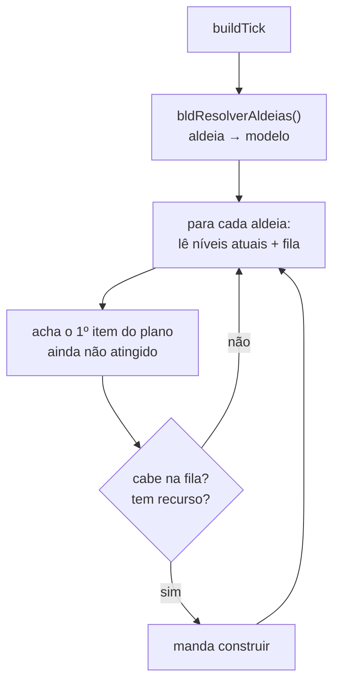

# Produção

`040-tropas` (recrutar) · `080-edificios` (Construções) · `082-pesquisa` (Ferreiro) ·
`085-obra` · `030-recrutar` (helpers)

Quatro módulos que fazem a aldeia crescer. Todos seguem o
[esqueleto comum de tick](fluxo-saque#o-esqueleto-comum-dos-três-ticks); o que muda é a
decisão no meio.

---

## Um conceito compartilhado: modelo + atribuição

Três destes módulos usam a mesma ideia, e vale entendê-la uma vez:

Atribuição **avulsa** e atribuição **por grupo** podem discordar. A regra é explícita: vence
o grupo **aplicado por último**. Antes disso, a avulsa atropelava o grupo em silêncio — o
usuário marcava um grupo inteiro e algumas aldeias simplesmente ignoravam.

---

## `030-recrutar.js` — os helpers

91 linhas, sem ciclo próprio. Guarda o que os outros usam:

- **`getAllVillages()`** / `getAllVillagesCached()` — a lista de aldeias, base de quase tudo.
- **`getGroups()`** — os grupos do jogo, já com o `tipo` (`static` / `dynamic` / `all`).
  A distinção importa: grupo **dinâmico** é uma consulta, não uma lista — atribuir modelo a
  ele daria resultado diferente a cada ciclo. Módulos que pedem escolha de grupo oferecem só
  os **estáticos** (`gruposEstaticos()`).

---

## `040-tropas.js` — Recrutar

O módulo mira um **estoque-alvo**, não uma quantidade fixa por ciclo: ele olha o que já
existe (em casa + na fila) e encomenda só o que falta. Erro de rede na resolução dos alvos
reagenda pra 2 min em vez de desligar.

---

## `080-edificios.js` — Construções

Rotulado **Construções** na interface. Executa um **plano de construção** por aldeia: uma
lista ordenada de `{edifício, nível}`.

Pontos que já morderam:

- **Demolição é interruptor global**, desligada por padrão. Não devolve recurso e não tem
  desfazer — tem que ser escolha consciente, nunca herdada de um `undefined`.
- O sanitizador do plano (`sanPlan`, em `010-core`) **corrige no lugar**. A versão que
  remontava `{b, lvl, en}` matava qualquer campo novo a cada `load()` e também na importação
  de backup, calada.
- O botão **Aplicar** carimba o modelo em **cada aldeia do grupo**, resolvendo a ambiguidade
  do "vence o último".

---

## `082-pesquisa.js` — Ferreiro

O módulo com o histórico mais acidentado do repo. Ele decide o que pesquisar comparando o
modelo com o que o Ferreiro já tem.

A dificuldade é que a tela do Ferreiro expõe **três** estados que se parecem:

| Estado | Como se detecta | O que significa |
|---|---|---|
| Completa | nível máximo atingido | nada a fazer |
| **Bloqueada** | `error_level: true`, unidade em `unavailable` | falta pré-requisito (ex.: Oficina nível 0) |
| **Em curso** | link "Cancelar" na linha da `table.vis` | já está sendo pesquisada agora |

Confundir os três foi a origem de três defeitos encadeados: unidade indisponível ficava
**invisível**, unidade em curso era contada como **completa**, e uma pesquisa bem-sucedida
era lida como **falha** (o servidor responde ou com `response` ou com `current_research`, e
o código só aceitava o primeiro).

Hoje `pesqCandidatos()` devolve `{candidatas, travadas}` com o **motivo** de cada trava — a
tela diz "não é que está completo, é que falta Oficina".

---

## `085-obra.js` — Obra

Ciclo curto (274 linhas) que toca a construção da obra/maravilha. Compartilha com o Ferreiro
a leitura `getSmithTechs()`, que devolve os blocos `available` **e** `unavailable`, marcando
o segundo com `_indisp`.

> Quando `getSmithTechs` passou a devolver também os indisponíveis (pra o Ferreiro poder
> explicá-los), a Obra passou a enxergá-los e parava a ordem neles. A correção é o
> `if (t._indisp) continue;` — vale como lembrete de que mudar o que um leitor
> compartilhado devolve mexe em todos os leitores.
