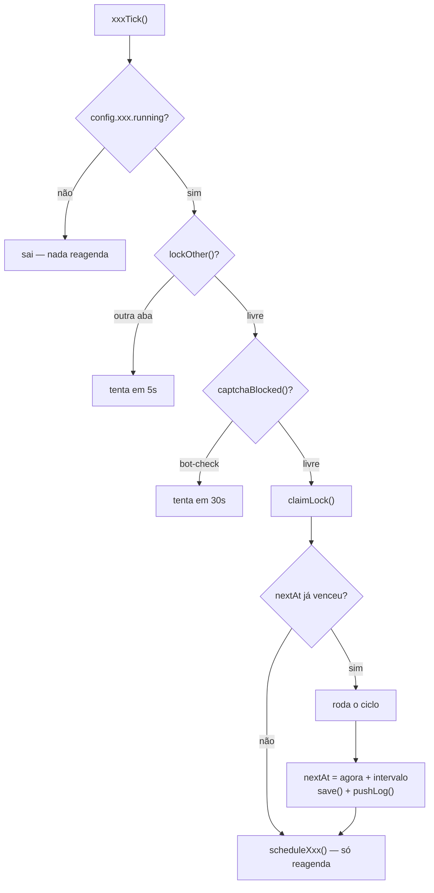
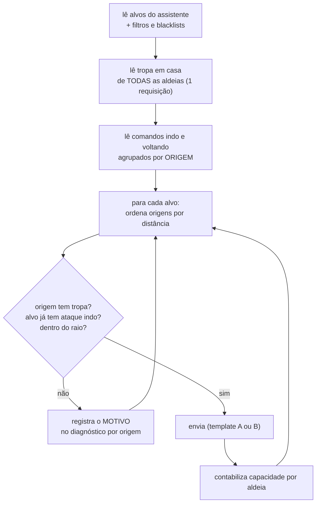

# Saque e coleta

`020-engine.js` (2155 linhas) · `095-saque-tplB.js` (157)

O `020-engine` é o motor mais antigo e o mais movimentado: quatro ciclos independentes
(**Coleta**, **Saque**, **Muralha** e o Auto-ATK legado) que partilham helpers de leitura de
tropa e de envio.

Na interface, **Muralha** e **Mapa** não são abas: são **sub-abas dentro do Saque**. As
chaves de módulo (`wall`, `map`) seguem valendo em `config`, `refreshCards` e `pushLog`.

---

## O esqueleto comum dos três ticks

Os três seguem exatamente a mesma abertura — é o contrato de todo módulo do repo:



`nextAt` no disco é o que faz o intervalo **sobreviver ao F5**: o timer morre no reload, mas
a hora do próximo ciclo não.

---

## Coleta — `scavTick`

Manda as aldeias coletarem nas quatro escavações.

1. `getAllScavengeState()` lê o estado de **todas** as aldeias de uma vez.
2. Por aldeia, decide quais escavações estão livres e quanta tropa cabe em cada.
3. Envia, respeitando reservas.

A leitura em massa é o ponto: ler aldeia por aldeia custaria uma requisição cada.

---

## Saque — `farmTick`

O ciclo mais complexo do repo, e o que mais gera pergunta.

### Trava de reentrada

```js
if (_farmEmVoo) { pushLog('já tem um ciclo rodando — ignorei o disparo repetido'); return; }
```

Só o Saque tem isso, e por um motivo: o ciclo é longo (dezenas de aldeias × dezenas de
alvos). Sem a trava, um segundo disparo entraria no meio do primeiro e os dois mandariam
tropa da mesma aldeia, cada um achando que ela estava cheia.

### O fluxo de decisão



### O diagnóstico

O que mais dói no Saque é "por que essa aldeia não atacou?". Por isso o ciclo mantém dois
mapas de diagnóstico:

- **`oDiag`** — por origem, com sete motivos de recusa distintos.
- **`alvoDiag`** — por alvo, mostrando **qual origem levou** cada um.

Eles alimentam a sub-aba **📊 Estatísticas** (Saque › Estatísticas), que mostra por aldeia:
quantos ataques estão *indo*, quantos *voltando*, a *carga* e a *previsão*.

> Quando um alvo tem poucas origens elegíveis, a conta é essa: 13 alvos para 39 origens
> significa 26 aldeias sem nada a fazer, e nenhuma delas está "quebrada".

---

## Muralha — `wallTick`

Manda derrubar muralha de alvos escolhidos. Mesma abertura dos outros; a diferença é a
composição (aríetes) e o critério de alvo.

**Comportamento atual:** manda da origem **mais próxima** que tenha tropa. Não escala pra
segunda/terceira mais próxima no mesmo ciclo.

---

## Template B do assistente — `095-saque-tplB.js`

O assistente de saque do jogo tem dois modelos, A e B. Este módulo descobre o `template_id`
do B direto do `am_farm` e envia pelo **endpoint oficial do assistente** — em vez de montar
um ataque na praça.

Por que pelo assistente: o alvo continua listado com relatório fresco, que é o que mantém as
cores (verde/amarelo/vermelho) e as blacklists funcionando.

O cache é **por aldeia**, com TTL de 30 min. Hoje só existe um chamador e ele sempre passa a
mesma aldeia — mas a chave por aldeia está lá pra o dia em que houver um segundo, quando uma
gaveta única faria a primeira aldeia responder por todas as outras em silêncio.
