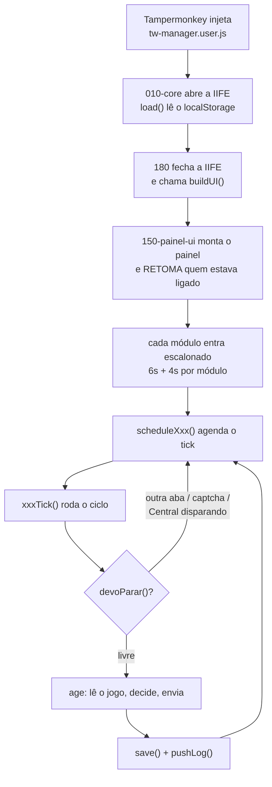

# TW Manager

Userscript de automação para **Tribal Wars**. Um arquivo só chega no navegador
(`tw-manager.user.js`, ~23 mil linhas), mas ele é **gerado** — a fonte da verdade são os
34 módulos em `src/*.js`.

> **A regra de ouro:** não edite `tw-manager.user.js`. Edite o módulo em `src/` e rode
> `python tools/build.py`. Quem edita o gerado perde o trabalho no build seguinte.

---

## Como ler esta documentação

Cada página descreve o **fluxo** de um grupo de módulos: por onde o ciclo entra, que
decisões ele toma, o que ele grava e onde ele pode falhar. A ordem sugerida:

1. **[Arquitetura](arquitetura)** — como 34 arquivos viram um; escopo compartilhado, ciclo
   de vida, e os cinco mecanismos que *todo* módulo obedece. Leia esta primeiro: sem ela, o
   fluxo de qualquer módulo individual parece arbitrário.
2. Depois, a página do domínio que te interessa.

---

## Mapa dos módulos

Prefixo de 3 dígitos = ordem de concatenação. Os buracos (`060`, `090`…) são folga
deliberada pra inserção futura.

<div class="tabela" markdown="1">

| Módulo | Linhas | Ciclo | Config | Página |
|---|---:|---|---|---|
| `010-core` | 1139 | — | *(todas)* | [Arquitetura](arquitetura) |
| `020-engine` | 2155 | `scavTick` `farmTick` `wallTick` | `scav` `farm` `wall` | [Saque e coleta](fluxo-saque) |
| `030-recrutar` | 91 | — | — | [Produção](fluxo-producao) |
| `040-tropas` | 968 | `recruitTick` | `recruit` | [Produção](fluxo-producao) |
| `050-envio` | 86 | — | — | [Apoio e defesa](fluxo-apoio) |
| `070-paladino` | 250 | `paladinTick` | `paladin` | [Auxiliares](fluxo-auxiliares) |
| `075-mercado` | 813 | `marketTick` | `market` | [Mercado](fluxo-mercado) |
| `080-edificios` | 1035 | `buildTick` | `build` | [Produção](fluxo-producao) |
| `082-pesquisa` | 578 | `researchTick` | `research` | [Produção](fluxo-producao) |
| `084-noblar` | 2966 | `nobleTick` | `noble` | [Noblar](fluxo-noblar) |
| `085-obra` | 274 | `obraTick` | `obra` | [Produção](fluxo-producao) |
| `086-apoios` | 802 | — | — | [Apoio e defesa](fluxo-apoio) |
| `088-alvos` | 408 | — | *(fichas)* | [Auxiliares](fluxo-auxiliares) |
| `092-reliquias` | 489 | — | `rel` | [Auxiliares](fluxo-auxiliares) |
| `095-saque-tplB` | 157 | — | — | [Saque e coleta](fluxo-saque) |
| `100-barbaros-mapa` | 627 | `mapTick` | `map` | [Mapa e bárbaros](fluxo-mapa) |
| `110-cadeado` | 112 | `lockTick` | `lock` | [Mapa e bárbaros](fluxo-mapa) |
| `120-etiqueta` | 156 | `etiquetaTick` | `etiqueta` | [Mapa e bárbaros](fluxo-mapa) |
| `130-captcha` | 198 | *(observador)* | `captcha` | [Arquitetura](arquitetura) |
| `140-painel-controllers` | 310 | — | — | [Arquitetura](arquitetura) |
| `150-painel-ui` | 1517 | *(bootstrap)* | *(todas)* | [Arquitetura](arquitetura) |
| `155-backup` | 157 | — | *(todas)* | [Auxiliares](fluxo-auxiliares) |
| `160-desviar` | 617 | *(agendado)* | `desviar` | [Apoio e defesa](fluxo-apoio) |
| `170-mapa` | 649 | — | `map` | [Mapa e bárbaros](fluxo-mapa) |
| `171-cc-nucleo` | 1174 | `cmdTick` | `cmd` | [Centro de Comando](fluxo-centro-comando) |
| `172-cc-praca` | 2103 | — | `cmd` | [Centro de Comando](fluxo-centro-comando) |
| `173-cc-operacao` | 539 | — | `cmd.op` | [Centro de Comando](fluxo-centro-comando) |
| `174-cc-atkmassa` | 172 | — | `cmd` | [Centro de Comando](fluxo-centro-comando) |
| `175-cc-apoiomassa` | 133 | — | `cmd` | [Centro de Comando](fluxo-centro-comando) |
| `176-cc-blindagem` | 447 | — | `cmd.blz` | [Centro de Comando](fluxo-centro-comando) |
| `177-cc-calibrar` | 276 | — | `cmd.calib` | [Centro de Comando](fluxo-centro-comando) |
| `178-cc-ensaio` | 190 | — | *(sem estado)* | [Centro de Comando](fluxo-centro-comando) |
| `179-cc-painel` | 855 | — | `cmd` | [Centro de Comando](fluxo-centro-comando) |
| `180-centro-comando` | 1526 | `ccTick` | `cc` | [Centro de Comando](fluxo-centro-comando) |

</div>

---

## O ciclo de vida, em uma imagem



O escalonamento de 6s + 4s por módulo não é enfeite: sem ele, dez módulos disparariam
requisição no mesmo instante em que a própria página do jogo ainda está carregando os
recursos dela — o caminho mais curto pra um `429`.

---

## Fluxo de desenvolvimento

```bash
# 1. edite o módulo certo em src/
# 2. gere o userscript
python tools/build.py
# 3. valide (roda no pre-commit também)
python tools/check.py
# 4. sintaxe de VERDADE, com motor JS
node -e "new Function(require('fs').readFileSync('tw-manager.user.js','utf8'))"
# 5. commite src/ E o tw-manager.user.js gerado, juntos
```

O `check.py` olha o **texto**: `const` declarado duas vezes no mesmo escopo, `@version`
fora de sincronia com `const VERSION`, delimitador desbalanceado, BOM. Saída ≠ 0 =
não publique.
